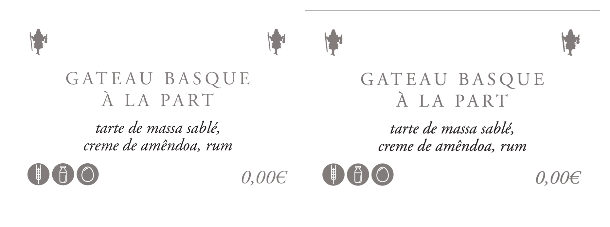

# bakery-label-press

> **Print-ready bakery labels from a Google Sheet.** Staff edit products in a
> spreadsheet, click 🥖 in the menu bar, and a branded A4 PDF (8 labels per
> sheet, 79.95 × 56.24 mm each, with crop marks for cutting) lands in Google
> Drive ~2 minutes later.

Originally built for **Lully 1661 Boulangerie** (Lisbon). Their design ships
in this repo as the working reference — fork, rebrand, and you have a
production-ready label pipeline for any pastry shop.



## What it does

```
Google Sheet  ──── 🥖 menu → "Generate"  ────┐
  (real_data tab)                              ▼
                                  GitHub: repository_dispatch
                                              │
                                              ▼
                          GitHub Actions: scripts/release-labels.py
                                              │
                          ┌───────────────────┼─────────────────────┐
                          ▼                   ▼                     ▼
                   Sheets API         CSV → HTML → PDF         Drive API
                  (read tab)          (Chrome headless)     (upload PDF + CSV)
                          │                                          │
                          └────────────────► release_history ◄───────┘
```

- **Pixel-fidelity**: dimensions, fonts, colors, allergen icons, and figurine
  silhouette are all reverse-engineered from a source InDesign-printed PDF
  (see [`reference-pdf/`](reference-pdf/) and [`docs/design-reference/`](docs/design-reference/)).
- **Cloud-only execution**: no machine to babysit. Staff click; CI runs.
- **Audit log**: every release writes a row in the Sheet's `release_history`
  tab with a Drive link to the PDF and a CSV snapshot of the source data
  that produced it (so any past label set is reproducible).
- **Self-contained typography**: ships with [EB Garamond](https://fonts.google.com/specimen/EB+Garamond)
  (Google Fonts, OFL) — a 1:1 open-source revival of the Adobe Garamond Pro
  used in the source design.

## Quick start

### Option A · run locally (no GitHub Actions yet)

```bash
python3 -m venv .venv && source .venv/bin/activate
pip install -r scripts/requirements-labels.txt
python3 scripts/build-labels.py --pdf
open dist/labels.pdf
```

You get an A4 PDF with the 8 sample products from `data/labels-sample.csv`.

### Option B · full Sheet → Drive pipeline

Read [`docs/sheet-setup.md`](docs/sheet-setup.md) — walks through the
30 minutes of one-time setup (Google OAuth client, refresh token, GitHub
secrets, Apps Script paste). After that, anyone with edit access to the
Sheet just clicks the button.

## Layout reference

The label cell is **79.95 × 56.24 mm** with elements positioned at the exact
coordinates extracted from the source PDF:

| Element     | Font                        | Size  | Cell-relative position             |
|-------------|-----------------------------|-------|------------------------------------|
| Figurine    | (vector silhouette × 2)     | 4.80 × 7.16 mm | top=5.05mm, side inset=5.30mm |
| Title       | Garamond Regular, uppercase | 14pt  | top=15.90mm, line-height=1.302, letter-spacing=0.26em |
| Description | Garamond Italic             | 13pt  | top=29.39mm, line-height=1.030     |
| Allergens   | (vector circles)            | 5.97 × 5.97 mm | top=41.61mm, left=4.69mm, edge-to-edge |
| Price       | Garamond Italic             | 15pt  | top=42.51mm, right inset=5.12mm    |
| Color       | `#7B7676`                   | —     | applies to text + iconography      |
| Sheet       | A4 portrait, 2 cols × 4 rows | —    | margins t/b=27.04mm, l=20.08, r=20.67; col gap=9.34mm; row gap=5.99mm |

`docs/design-reference/single-label.html` is a pixel-perfect single-cell
reproduction with **vector text glyphs** extracted from the source — kept as
the visual ground truth.

## Customization

To rebrand for another bakery:

1. **Replace `templates/labels/icons/figurine.svg`** with your shop's mark.
   The slot renders at 4.80 × 7.16 mm so a tall narrow silhouette works best.
2. **Replace allergen icons** in the same folder if you want a different
   icon style. Match the stroke width and grey-circle style for consistency.
3. **Update `data/labels-sample.csv`** with your products.
4. **Tune `templates/labels/labels.css`** — color via `--label-grey`, fonts
   via `--font-display` / `--font-body`. To use your own licensed
   Garamond OTF instead of the bundled EB Garamond, drop the file at
   `templates/labels/fonts/<name>.otf` and add an `@font-face` block at the
   top of `labels.css`. The fallback chain already lists Adobe Garamond Pro
   first, so the CSS will pick it up automatically.

For data-driven multi-allergen icons, edit `ALLERGEN_COLS` in
`scripts/build-labels.py` and the matching `COLUMNS` array in
`apps-script/lully-labels.gs`.

## Architecture

| File                                        | Purpose                                              |
|---------------------------------------------|------------------------------------------------------|
| `scripts/build-labels.py`                   | CSV → HTML/PDF (works locally; no Google deps)       |
| `scripts/release-labels.py`                 | Sheet → CSV → PDF → Drive upload → history log      |
| `scripts/oauth-setup.py`                    | One-time helper to mint the Google OAuth refresh token |
| `templates/labels/labels.html.j2`           | Jinja2 template for the A4 sheet                     |
| `templates/labels/labels.css`               | Print-aware CSS (positions everything in mm)         |
| `templates/labels/icons/`                   | 6 vector icons: 1 figurine + 5 allergens             |
| `apps-script/lully-labels.gs`               | Sheet UI: menu, tab setup, GitHub dispatch caller    |
| `.github/workflows/build-labels.yml`        | CI workflow — runs on `repository_dispatch`          |
| `docs/sheet-setup.md`                       | End-to-end operator setup                            |
| `docs/design-reference/`                    | Pixel-perfect single-cell reference + comparison    |
| `reference-pdf/Plano etiquetas (easy).pdf`  | Original source design (the brand owner's print master) |

## License

**Code** (everything except the assets called out below): MIT. See [LICENSE](LICENSE).

**Brand assets shipped under**:
- `templates/labels/icons/figurine.svg`, `docs/design-reference/icons/figurine.svg`
- `reference-pdf/Plano etiquetas (easy).pdf`
- `docs/design-reference/single-label.*` (the rendered Lully-branded reproductions)
- `data/labels-sample.csv` (real product names + prices)

These are the property of **Lully 1661 Boulangerie** and are shipped here
with their permission as the working reference brand. **If you fork this
project for your own bakery, replace these files with your own assets.**

## Credits

- **Design** — Lully 1661 Boulangerie, Lisbon
- **Type** — [EB Garamond](https://fonts.google.com/specimen/EB+Garamond) by
  Georg Duffner & Octavio Pardo (SIL Open Font License)
- **Engineering** — built with [Claude Code](https://claude.com/claude-code)
